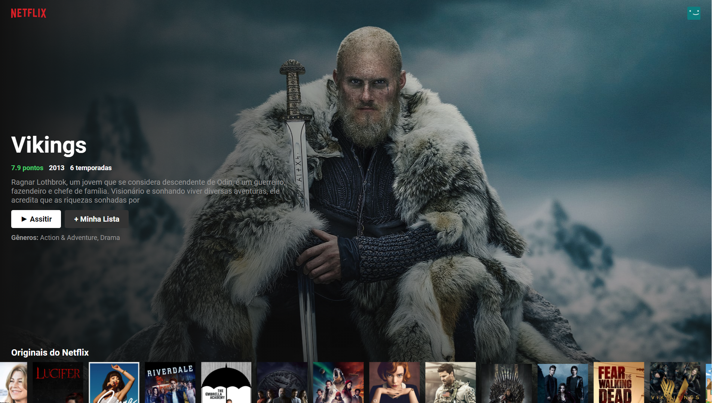
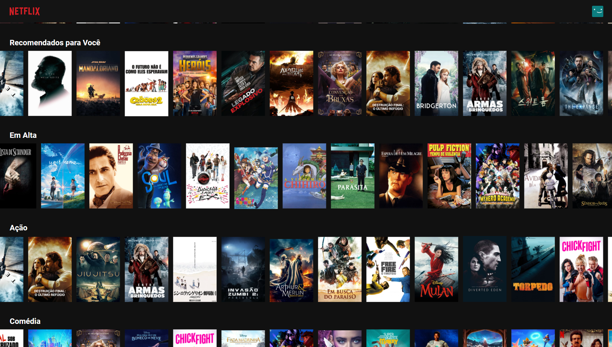

<h1 align="center">
  🐾 Clone do Netflix Web
</h1>

  <a href="#rocket-tecnologias">Tecnologias</a>&nbsp;&nbsp;&nbsp;|&nbsp;&nbsp;&nbsp;
  <a href="#-projeto">Projeto</a>&nbsp;&nbsp;&nbsp;|&nbsp;&nbsp;&nbsp;
  <a href="#-layout">Desenvolvimento</a>&nbsp;&nbsp;&nbsp;|&nbsp;&nbsp;&nbsp;
  <a href="#-layout">Créditos pelas imagens</a>&nbsp;&nbsp;&nbsp;|&nbsp;&nbsp;&nbsp;

 

  

 

  

 

## 📛 Tecnologias

Esse projeto foi desenvolvido com as seguintes tecnologias:

- [React.JS](https://reactjs.org)

## 🏀 Projeto

O objetivo é clonar a página do Web (Home) da Netflix junto com algumas caracteristicas e funcionalidades.

## 💹 Desenvolvimento

- Conexão com o TMDB (The Movie Database)
- Buscando as informações e listando na tela
- Estilização da série ou filme em destaque com as suas respectivas informações
- Estilização das listas
- Animação de tela de carregamento

## 🔦 Créditos pelas imagens

Todas as imagens são de direitos da Netflix